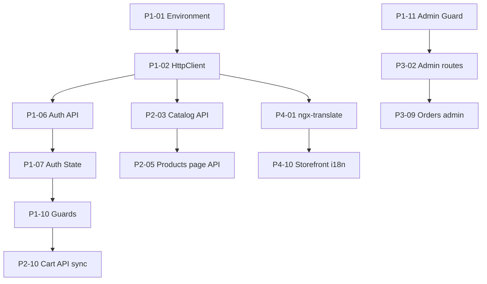

# HAMBOX Frontend — Sprint 1 Completion Plan

**Date:** 2026-06-24  
**Author role:** Senior Angular Architect  
**Status:** Planning only — no implementation  
**Angular version:** 21.x (standalone components, signals)

---

## 1. Purpose

Define the **minimum Angular work** required to satisfy Sprint 1, given:

- Angular project scaffold exists with PrimeNG installed
- Storefront UI is largely built with **static mock data**
- Admin and auth features are **route stubs only**
- Backend Sprint 1 is **mostly complete** (API contracts assumed; confirm against backend OpenAPI/Swagger)

> **Note:** No formal `Sprint-1-Requirements.md` was found in this repository. Sprint 1 scope below is derived from the existing route map, UI inventory, user-stated phases, and standard marketplace MVP expectations. Validate endpoint paths and DTOs with the backend team before implementation.

---

## 2. Sprint 1 Target Outcomes

| Capability | Sprint 1 “done” definition |
|------------|---------------------------|
| **Authentication** | Users can register, log in, persist session (JWT), and access protected routes; admins are role-gated |
| **Public marketplace** | Guest and authenticated users can browse home, products, product details, cart, and complete checkout using **live API data** |
| **Admin dashboard** | Admin users manage orders, customers, and inventory behind a dedicated shell with KPI overview |
| **Localization** | Language and currency can be switched; UI strings externalized; RTL supported for Arabic |

---

## 3. Current State Assessment

### 3.1 What exists and works (UI-only)

| Area | Routes | Implementation | Data source |
|------|--------|----------------|-------------|
| Home | `/home` | **Complete** — hero, trust bar, categories, flash deals, trending, footer | `storefront-home-data.ts` (static) |
| Products | `/products` | **Complete** — filters, toolbar, grid, load more | `storefront-products-data.ts` (static) |
| Product details | `/product-details` | **Complete** — gallery, selectors, add-to-cart UI | `product-details-data.ts` (static, single product) |
| Cart | `/cart` | **Complete** — line items, summary, empty state | `Cart` signal service + `cart-data.ts` |
| Checkout | `/checkout`, `/processing`, `/success` | **Complete** — payment, billing, order success flow | `Checkout` signal service + mock data |
| Storefront nav | Per-page | `TopNavGuestComponent`, `TopNavUserComponent` (locale/currency buttons are **non-functional**) | Hardcoded |
| Shared storefront | — | `storefront-footer`, cards, field-select, etc. | Static |
| PrimeNG admin shell | — | `navbar`, `sidebar`, `topbar`, `search-box` built but **not wired** | — |

### 3.2 What exists as stubs

| Area | Routes | Current state |
|------|--------|---------------|
| Login | `/auth/login` | `<p>login works!</p>` |
| Register | `/auth/register` | `<p>register works!</p>` |
| Profile | `/profile` | Stub |
| Favorites | `/favorites` | Stub |
| Support chat | `/support-chat` | Stub |
| Dashboard | `/dashboard` | Stub |
| Orders (admin) | `/orders` | Stub |
| Customers | `/customers` | Stub |
| Inventory | `/inventory` | Stub |

### 3.3 Missing infrastructure

| Item | Status |
|------|--------|
| `src/app/core/` | **Missing** — no guards, interceptors, API client, or environment config |
| `provideHttpClient` | **Not configured** in `app.config.ts` |
| `provideAnimations` / `providePrimeNG` | **Not configured** |
| `@ngx-translate` | Installed in `package.json`, **not wired** |
| Route guards | **None** |
| HTTP interceptors | **None** |
| Environment files | **None** (`apiUrl`, feature flags) |
| Admin layout | **Does not exist** — admin routes share bare `main-layout` |
| Auth layout branding | Bare `<router-outlet>` only |
| Storefront layout | Nav/footer duplicated per page instead of a shared shell |
| Dynamic routing | Product details has **no `:id` param** |
| API integration | **Zero** — all features use static TypeScript data |

### 3.4 Dependency packages ready but unused

| Package | Intended Sprint 1 use |
|---------|----------------------|
| `jwt-decode` | Decode access token claims (roles, expiry) |
| `@ngx-translate/core` + `http-loader` | i18n |
| `ng-apexcharts` + `apexcharts` | Admin dashboard charts |
| `dayjs` | Date formatting (orders, deals countdown) |
| `file-saver` + `xlsx` | Admin export (orders/inventory) |
| `primeflex` | Admin layout utilities |

---

## 4. Gap Analysis

### 4.1 Missing pages

| Page | Priority | Notes |
|------|----------|-------|
| **Login** | P0 | Replace stub; wire to `POST /api/auth/login` |
| **Register** | P0 | Replace stub; wire to `POST /api/auth/register` |
| **Profile (account)** | P1 | View/edit name, email; change password if backend supports |
| **My Orders (customer)** | P1 | Order history for authenticated buyers — may reuse orders feature with role-based view |
| **Dashboard (admin)** | P0 | KPI cards + charts |
| **Orders (admin)** | P0 | List, filter, detail, status update |
| **Customers (admin)** | P0 | List, search, detail |
| **Inventory (admin)** | P0 | Stock list, adjust quantities, low-stock indicators |
| **404 Not Found** | P2 | Replace catch-all redirect to home |
| **Favorites** | P3 | Defer unless explicitly in Sprint 1 backend |
| **Support chat** | P3 | Defer unless backend chat API exists in Sprint 1 |

### 4.2 Missing layouts

| Layout | Priority | Description |
|--------|----------|-------------|
| **Auth layout** | P0 | Branded split-panel or centered card shell for login/register |
| **Storefront layout** | P1 | Wraps guest/user nav + `<router-outlet>` + footer; removes per-page duplication |
| **Admin layout** | P0 | Sidebar + topbar + content area using existing `sidebar`, `topbar`, `navbar` components |
| **Account layout** | P2 | Optional sub-shell for profile/orders under authenticated nav |

### 4.3 Missing routing

| Change | Priority | Description |
|--------|----------|-------------|
| **Admin route prefix** | P0 | e.g. `/admin/dashboard`, `/admin/orders` — separate from public URLs |
| **Admin layout lazy route** | P0 | `loadComponent: AdminLayoutComponent` with `canActivate: [adminGuard]` |
| **`authGuard` on protected routes** | P0 | `/checkout`, `/profile`, `/cart` (if cart is user-scoped server-side) |
| **`guestGuard` on auth routes** | P1 | Redirect logged-in users away from `/auth/login` |
| **`adminGuard` + role check** | P0 | Restrict `/admin/**` to `Admin` role from JWT |
| **Product details `:id`** | P0 | `/products/:id` or `/product-details/:id` |
| **Query-param search** | P1 | `/products?q=...&category=...` synced with toolbar/filters |
| **Post-login redirect** | P1 | `returnUrl` query param support |
| **Dedicated 404 route** | P2 | `path: '**'` → NotFoundComponent instead of redirect |

### 4.4 Missing API integrations

Assumed backend Sprint 1 endpoints (confirm names/paths with backend):

#### Authentication
| Endpoint | Frontend consumer |
|----------|-------------------|
| `POST /api/auth/register` | Register page |
| `POST /api/auth/login` | Login page |
| `POST /api/auth/refresh` | Token refresh on 401 |
| `GET /api/auth/me` | Profile, nav avatar, role resolution |
| `POST /api/auth/logout` | Optional server-side invalidation |

#### Catalog (public)
| Endpoint | Frontend consumer |
|----------|-------------------|
| `GET /api/products` | Products page (filters, sort, pagination) |
| `GET /api/products/{id}` | Product details |
| `GET /api/categories` | Home categories, nav pills, filters |
| `GET /api/home/featured` or composed calls | Home flash deals, trending, hero promos |

#### Cart & checkout
| Endpoint | Frontend consumer |
|----------|-------------------|
| `GET /api/cart` | Cart page (authenticated) |
| `POST /api/cart/items` | Add to cart from PDP |
| `PATCH /api/cart/items/{id}` | Quantity update |
| `DELETE /api/cart/items/{id}` | Remove item |
| `POST /api/orders` | Checkout submit |
| `GET /api/orders/{id}` | Order success / processing polling |
| `GET /api/orders` (scoped to user) | Customer order history |

#### Admin
| Endpoint | Frontend consumer |
|----------|-------------------|
| `GET /api/admin/dashboard` | KPI summary |
| `GET /api/admin/orders` | Orders table |
| `PATCH /api/admin/orders/{id}/status` | Status workflow |
| `GET /api/admin/customers` | Customers table |
| `GET /api/admin/customers/{id}` | Customer detail |
| `GET /api/admin/inventory` | Inventory table |
| `PATCH /api/admin/inventory/{id}` | Stock adjustment |

#### Localization
| Endpoint | Frontend consumer |
|----------|-------------------|
| `GET /api/localization/languages` | Language switcher options |
| `GET /api/localization/currencies` | Currency switcher options |
| `GET /api/localization/rates` | Optional FX conversion |

#### Cross-cutting
| Concern | Implementation |
|---------|----------------|
| `Authorization: Bearer {token}` | Auth interceptor |
| `Accept-Language: {locale}` | Language interceptor |
| Error mapping (400/401/403/500) | Error interceptor + toast messages |
| Loading states | Shared loading service or per-feature signals |

### 4.5 Missing localization features

| Feature | Current state | Required |
|---------|---------------|----------|
| `ngx-translate` bootstrap | Not configured | `provideHttpClient` + translate loader in `app.config.ts` |
| Translation files | None | `public/assets/i18n/en.json`, `ar.json` (minimum) |
| Language switcher | UI button in `top-nav-user` (hardcoded `EN`) | Wire to `TranslateService.use()` |
| Currency switcher | UI button (hardcoded `USD`) | `CurrencyService` + display pipe |
| RTL support | None | `dir="rtl"` on `<html>` when `ar` active; audit storefront SCSS |
| Date/number formatting | Hardcoded | `DatePipe` / `CurrencyPipe` with active locale |
| API locale header | None | Interceptor sends `Accept-Language` |
| Admin i18n | N/A | Translate PrimeNG table headers, menu labels |

### 4.6 Missing admin features

| Feature | Current state | Required minimum |
|---------|---------------|------------------|
| Admin shell | Components exist, unused | Sidebar menu, topbar, responsive drawer |
| Dashboard KPIs | Stub page | Revenue, orders today, active customers, low-stock count |
| Charts | `ng-apexcharts` installed | Revenue/orders trend line or bar chart |
| Orders management | Stub | PrimeNG Table, filters, status badges, detail drawer/dialog |
| Customers management | Stub | Searchable table, view detail |
| Inventory management | Stub | Stock levels, edit quantity, low-stock highlight |
| Export | Packages installed | CSV/XLSX export on orders/inventory tables |
| Access control | None | Admin-only guard; hide admin nav from non-admins |

---

## 5. Architecture Recommendations (Sprint 1 minimum)

### 5.1 Proposed folder structure

```
src/app/
├── core/
│   ├── guards/          auth.guard, guest.guard, admin.guard
│   ├── interceptors/    auth.interceptor, error.interceptor, locale.interceptor
│   ├── services/        api-base, token-storage, locale, currency
│   └── models/          api-response, pagination, user-session
├── layouts/
│   ├── auth-layout/
│   ├── storefront-layout/   (new)
│   ├── admin-layout/        (new)
│   └── main-layout/         (deprecate or keep as passthrough)
├── features/                (existing — wire to APIs)
└── shared/
    ├── components/          (wire empty-state, loading-skeleton)
    └── pipes/               currency-display, safe-date
```

### 5.2 Route topology (target)

```
/auth/login, /auth/register          → AuthLayout + guestGuard

/  (StorefrontLayout)
  /home
  /products, /products/:id
  /cart
  /checkout, /checkout/processing, /checkout/success
  /profile                             → authGuard
  /orders                              → authGuard (customer orders)

/admin  (AdminLayout + adminGuard)
  /dashboard
  /orders
  /customers
  /inventory

/**  → NotFoundPage (optional Sprint 1)
```

### 5.3 Nav behavior

| Auth state | Nav component | Shown on |
|------------|---------------|----------|
| Guest | `TopNavGuestComponent` | Home, products (browse) |
| Authenticated | `TopNavUserComponent` | Cart, checkout, profile |
| Admin (in admin area) | Admin topbar/sidebar | `/admin/**` |

---

## 6. Dependency-Ordered Implementation Backlog

Effort scale: **person-days (pd)** for one mid-level Angular developer.  
`Depends on` lists task IDs that must complete first.

---

### Phase 1 — Authentication

| ID | Task | Effort | Depends on | Deliverable |
|----|------|--------|------------|-------------|
| P1-01 | Create `core/` module structure and `environment.ts` / `environment.development.ts` with `apiUrl` | 0.5 pd | — | Config files + `fileReplacements` in `angular.json` |
| P1-02 | Add `provideHttpClient(withInterceptors([...]))` to `app.config.ts` | 0.25 pd | P1-01 | HTTP client available app-wide |
| P1-03 | Add `provideAnimations()` and `providePrimeNG()` with HAMBOX theme preset | 0.5 pd | — | PrimeNG dialogs/toasts/tables work globally |
| P1-04 | Define auth models (`LoginRequest`, `RegisterRequest`, `AuthResponse`, `UserSession`) | 0.5 pd | — | Typed contracts matching backend DTOs |
| P1-05 | Implement `TokenStorageService` (access/refresh in `sessionStorage` or `localStorage`) | 0.5 pd | P1-04 | Persist session across refresh |
| P1-06 | Implement `AuthApiService` — login, register, refresh, me | 1 pd | P1-02, P1-04 | API calls to auth endpoints |
| P1-07 | Implement `AuthStateService` (signals: `user`, `isAuthenticated`, `isAdmin`) using `jwt-decode` | 1 pd | P1-05, P1-06 | Central auth state |
| P1-08 | `authInterceptor` — attach Bearer token | 0.5 pd | P1-05, P1-02 | Authenticated API calls |
| P1-09 | `errorInterceptor` — handle 401 refresh-or-logout, map errors to user messages | 1 pd | P1-06, P1-08 | Graceful auth failures |
| P1-10 | `authGuard` — protect routes requiring login | 0.5 pd | P1-07 | Route protection |
| P1-11 | `adminGuard` — require `Admin` role from token claims | 0.5 pd | P1-07 | Admin route protection |
| P1-12 | `guestGuard` — redirect authenticated users from auth pages | 0.25 pd | P1-07 | Avoid duplicate login |
| P1-13 | Branded **auth layout** (logo, background, outlet) | 0.5 pd | P1-03 | Login/register shell |
| P1-14 | **Login page** — reactive form, validation, submit, error display | 1 pd | P1-06, P1-07, P1-13 | Working login |
| P1-15 | **Register page** — reactive form, validation, submit | 1 pd | P1-06, P1-07, P1-13 | Working registration |
| P1-16 | Logout action + session clear + redirect to home | 0.25 pd | P1-07 | Complete auth lifecycle |
| P1-17 | Dynamic nav switching (guest ↔ user) based on `AuthStateService` | 0.5 pd | P1-07 | Storefront reflects auth state |
| P1-18 | Apply guards to `/checkout`, `/profile`, `/cart` routes | 0.25 pd | P1-10 | Protected commerce routes |

**Phase 1 subtotal: ~9.5 pd**

---

### Phase 2 — Public Marketplace

| ID | Task | Effort | Depends on | Deliverable |
|----|------|--------|------------|-------------|
| P2-01 | Create **storefront layout** (nav slot + outlet + footer) | 1 pd | P1-17 | DRY storefront shell |
| P2-02 | Refactor home/products/cart/checkout to use storefront layout | 1 pd | P2-01 | Remove duplicated nav/footer imports |
| P2-03 | `CatalogApiService` — products list, product by id, categories | 1 pd | P1-02 | Catalog API layer |
| P2-04 | Add route `products/:id`; redirect old `/product-details` | 0.5 pd | — | Dynamic PDP routing |
| P2-05 | Wire **products page** to API — pagination, filters, sort (replace static data) | 2 pd | P2-03 | Live product grid |
| P2-06 | Wire **product details** to API — load by `:id`, region/value variants | 1.5 pd | P2-03, P2-04 | Dynamic PDP |
| P2-07 | `HomeApiService` — featured deals, trending, categories | 1 pd | P2-03 | Home API layer |
| P2-08 | Wire **home page** to API (replace `storefront-home-data.ts`) | 1 pd | P2-07 | Live home content |
| P2-09 | `CartApiService` — CRUD cart items on server | 1 pd | P1-08 | Server-backed cart |
| P2-10 | Refactor `Cart` service to sync with API (optimistic updates + fallback) | 2 pd | P2-09, P1-10 | Persistent cart |
| P2-11 | Wire **add to cart** on PDP to `CartApiService` | 0.5 pd | P2-06, P2-10 | End-to-end add flow |
| P2-12 | `CheckoutApiService` — create order, poll payment status | 1.5 pd | P1-08 | Order submission |
| P2-13 | Wire **checkout flow** to API (processing + success pages use real order id) | 2 pd | P2-12, P1-10 | Live checkout |
| P2-14 | Search — nav input navigates to `/products?q=`; products page reads query params | 1 pd | P2-05 | Working search |
| P2-15 | Shared loading/error states — use `loading-skeleton` and `empty-state` | 1 pd | P2-03 | UX for async data |
| P2-16 | **Profile page** — display/edit user from `GET/PATCH /api/auth/me` | 1.5 pd | P1-06, P1-10 | Account management |
| P2-17 | **Customer orders page** — list user's orders (`GET /api/orders`) | 1.5 pd | P1-10, P2-12 | Buyer order history |

**Phase 2 subtotal: ~18 pd**

---

### Phase 3 — Admin Dashboard

| ID | Task | Effort | Depends on | Deliverable |
|----|------|--------|------------|-------------|
| P3-01 | Create **admin layout** — wire `sidebar`, `topbar`, content area | 1.5 pd | P1-03 | Admin shell |
| P3-02 | Restructure routes under `/admin/**` with lazy features | 0.5 pd | P3-01, P1-11 | Isolated admin area |
| P3-03 | Admin sidebar menu config (dashboard, orders, customers, inventory) | 0.5 pd | P3-01 | Navigation |
| P3-04 | `AdminDashboardApiService` + KPI models | 0.5 pd | P1-08 | Dashboard API |
| P3-05 | **Dashboard page** — KPI stat cards | 1 pd | P3-04 | At-a-glance metrics |
| P3-06 | **Dashboard charts** — revenue/orders trend via `ng-apexcharts` | 1.5 pd | P3-04, P3-05 | Visual analytics |
| P3-07 | Shared admin table utilities (pagination, sorting, filter bar) | 1 pd | P1-03 | Reusable admin pattern |
| P3-08 | `AdminOrdersApiService` | 0.5 pd | P1-08 | Orders API |
| P3-09 | **Orders page** — PrimeNG Table, filters, status update | 2 pd | P3-07, P3-08 | Order management |
| P3-10 | Order detail dialog/drawer | 1 pd | P3-09 | View line items, customer |
| P3-11 | `AdminCustomersApiService` | 0.5 pd | P1-08 | Customers API |
| P3-12 | **Customers page** — searchable table + detail view | 1.5 pd | P3-07, P3-11 | Customer management |
| P3-13 | `AdminInventoryApiService` | 0.5 pd | P1-08 | Inventory API |
| P3-14 | **Inventory page** — stock table, inline edit, low-stock badges | 2 pd | P3-07, P3-13 | Inventory management |
| P3-15 | Export orders/inventory to XLSX (`xlsx` + `file-saver`) | 0.5 pd | P3-09, P3-14 | Admin export |
| P3-16 | Admin responsive behavior (sidebar → drawer on mobile) | 0.5 pd | P3-01 | Mobile admin UX |

**Phase 3 subtotal: ~15 pd**

---

### Phase 4 — Localization

| ID | Task | Effort | Depends on | Deliverable |
|----|------|--------|------------|-------------|
| P4-01 | Configure `ngx-translate` in `app.config.ts` with HTTP loader | 0.5 pd | P1-02 | i18n bootstrap |
| P4-02 | Create `public/assets/i18n/en.json` baseline (~150–200 keys) | 1 pd | P4-01 | English catalog |
| P4-03 | Create `public/assets/i18n/ar.json` Arabic translations | 1.5 pd | P4-02 | Arabic catalog |
| P4-04 | `LanguageService` — persist locale, expose `currentLang` signal | 0.5 pd | P4-01 | Locale state |
| P4-05 | `localeInterceptor` — send `Accept-Language` header | 0.25 pd | P4-04, P1-02 | API locale sync |
| P4-06 | **Language switcher** component; wire `top-nav-guest` and `top-nav-user` buttons | 1 pd | P4-04 | Working EN/AR toggle |
| P4-07 | RTL support — toggle `dir` on `document.documentElement`; audit storefront SCSS | 1 pd | P4-06 | Arabic layout |
| P4-08 | `CurrencyService` + `currencyDisplay` pipe | 1 pd | P1-02 | Currency state |
| P4-09 | **Currency switcher** — wire top-nav buttons; format prices in cart/checkout/PDP | 1 pd | P4-08 | Multi-currency display |
| P4-10 | Externalize storefront strings (home, products, cart, checkout, footer) | 2 pd | P4-02 | Translated storefront |
| P4-11 | Externalize auth + profile strings | 0.5 pd | P4-02, P1-14 | Translated auth |
| P4-12 | Externalize admin strings (sidebar, tables, dashboard) | 1 pd | P4-02, P3-01 | Translated admin |
| P4-13 | PrimeNG locale override for Arabic (`primeng/ar`) | 0.5 pd | P4-06 | Localized PrimeNG widgets |

**Phase 4 subtotal: ~11.25 pd**

---

## 7. Critical Path & Recommended Sequence



### Suggested sprint execution order

1. **Week 1:** P1-01 through P1-18 (auth foundation — blocks everything else)
2. **Week 2:** P2-03 through P2-13 (catalog + cart + checkout API — core revenue path)
3. **Week 3:** P3-01 through P3-14 (admin MVP)
4. **Week 4:** P4-01 through P4-13 + P2-14 through P2-17 (i18n + polish)

Localization (Phase 4) can start in parallel with Phase 3 once P1-02 is done, but **full string externalization (P4-10–P4-12)** should happen after page UIs stabilize to avoid rework.

---

## 8. Effort Summary

| Phase | Tasks | Estimated effort |
|-------|-------|------------------|
| Phase 1 — Authentication | 18 | **9.5 pd** |
| Phase 2 — Public Marketplace | 17 | **18 pd** |
| Phase 3 — Admin Dashboard | 16 | **15 pd** |
| Phase 4 — Localization | 13 | **11.25 pd** |
| **Total** | **64** | **~53.75 pd** |

For a team of 2 frontend developers working in parallel (auth+catalog week 1, admin+i18n week 2–3), Sprint 1 frontend completion is achievable in **~3–4 weeks** assuming backend APIs are stable and design assets for auth/admin pages are available.

---

## 9. Explicitly Out of Scope (Sprint 1 minimum)

| Item | Rationale |
|------|-----------|
| Favorites/wishlist | Stub only; no backend reference in repo |
| Support chat | Stub only; real-time chat is typically Sprint 2+ |
| Affiliate program | Footer link exists; no feature scaffold |
| Payment gateway SDK integration | Checkout UI exists; Sprint 1 may use backend-created payment session only |
| Full responsive QA pass | Storefront has breakpoints; admin responsive is P3-16 only |
| E2E test suite | Not in current project tooling |
| Dark/light theme toggle | Storefront is dark-only per design plan |
| Removing duplicate scaffold files (`*-page.ts` vs `*-page.component.ts`) | Cleanup task; defer to tech debt sprint |

---

## 10. Risks & Assumptions

| Risk | Mitigation |
|------|------------|
| Backend API contracts unknown in this repo | Obtain OpenAPI spec; create `core/models` from generated types or shared package |
| Cart guest vs authenticated semantics | Confirm with backend whether guest cart uses anonymous token or local-only until login |
| Admin role claim name mismatch | Align `jwt-decode` claim key (`role`, `roles`, `http://schemas...`) with backend |
| i18n key churn during UI changes | Complete API wiring first; externalize strings in Phase 4 |
| Product route migration (`/product-details` → `/products/:id`) | Add redirect route for bookmarks |
| PrimeNG bundle size | Lazy-load admin features; tree-shake unused modules |

**Assumptions:**
- Backend exposes REST JSON APIs under a single `apiUrl`
- JWT access + refresh token flow is implemented server-side
- Sprint 1 supports at least **English and Arabic** with **USD + one regional currency**
- Admin users share the same auth system with elevated role

---

## 11. Definition of Done (Sprint 1 Frontend)

- [ ] User can register, log in, log out; session persists on page reload
- [ ] Protected routes redirect unauthenticated users to login
- [ ] Admin routes reject non-admin users
- [ ] Home, products, and product details load data from API
- [ ] Cart and checkout persist through API for authenticated users
- [ ] Admin can view dashboard KPIs, manage orders, customers, and inventory
- [ ] User can switch language (EN/AR) and currency; Arabic renders RTL
- [ ] No storefront page relies on `*-data.ts` static mocks for primary content
- [ ] `ng build` passes with production configuration
- [ ] Manual smoke test documented (auth → browse → cart → checkout → admin login)

---

## 12. References

| Resource | Path |
|----------|------|
| App routes | `src/app/app.routes.ts` |
| App config | `src/app/app.config.ts` |
| Storefront home plan | `docs/plans/hambox-storefront-home-implementation-plan.md` |
| Static mock data | `src/app/features/*/services/*-data.ts` |
| Admin shell components | `src/app/shared/components/{sidebar,topbar,navbar}/` |
| Installed i18n packages | `package.json` → `@ngx-translate/core`, `@ngx-translate/http-loader` |
